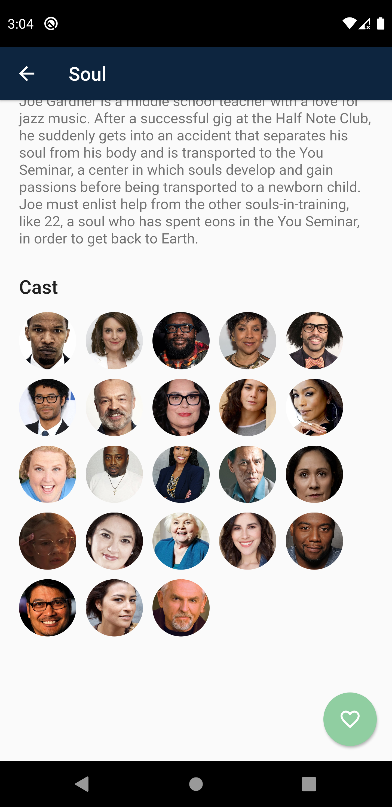
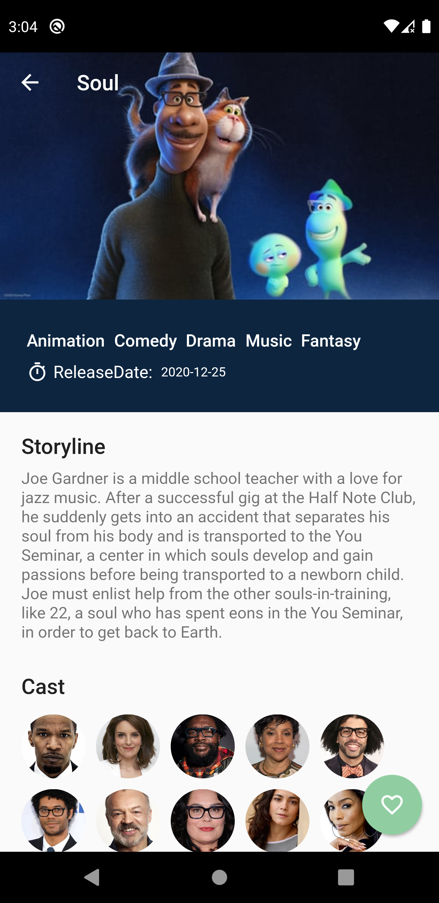
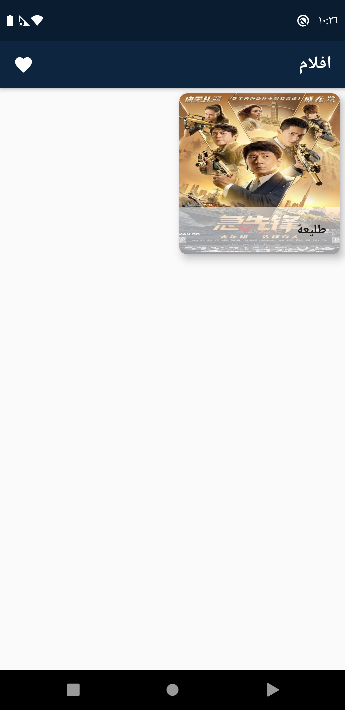
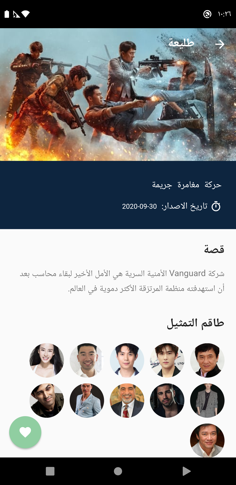

# movie_app

A simple flutter Movie application based on  themoviedb APIs.

## plugins used
- [flutter_bloc](https://pub.dev/packages/flutter_bloc) - A Flutter package that helps implement the BLoC pattern.
- [Chopper](https://pub.dev/packages/chopper) - Chopper is an http client generator using source_gen and inspired by Retrofit.
- [flutter_screenutil](https://pub.dev/packages/flutter_screenutil) - A flutter plugin for adapting screen and font size.Let your UI display a reasonable layout on different screen sizes.
- [injectable](https://pub.dev/packages/injectable) - Injectable is a convenient code generator for get_it. Inspired by Angular DI, Guice DI and inject.dart.
- [auto_route](https://pub.dev/packages/auto_route) - AutoRoute is a declarative routing solution, where everything needed for navigation is automatically generated for you.
- [sqflite](https://pub.dev/packages/sqflite) - Flutter plugin for SQLite, a self-contained, high-reliability, embedded, SQL database engine.